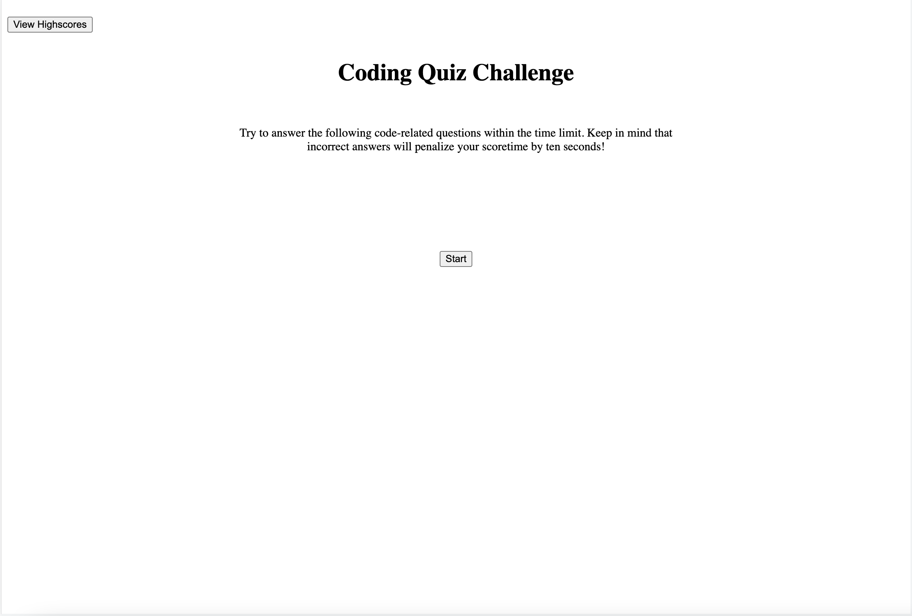
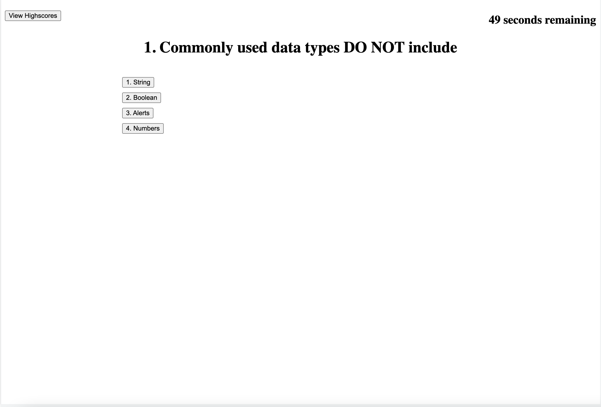

# 04-Web-APIs-Challenge

Deployed URL: https://paksin.github.io/04-Web-APIs-Challenge/

This week's Challenge requires us to build a timed coding quiz with multiple-choice questions. This app will run in the browser and will feature dynamically updated HTML and CSS powered by JavaScript code that you write. It will have a clean, polished, and responsive user interface.

Below are some snapshots of the application:

